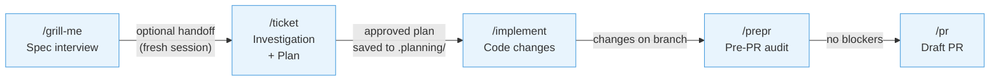
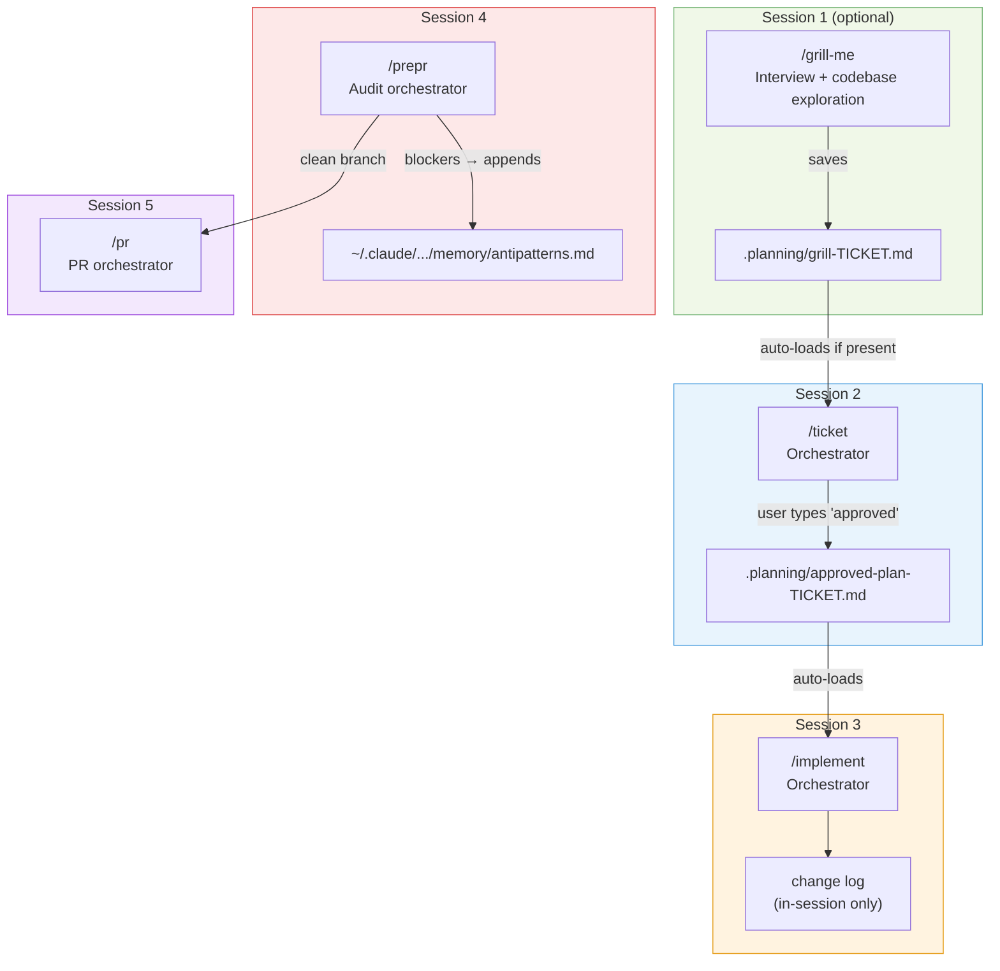
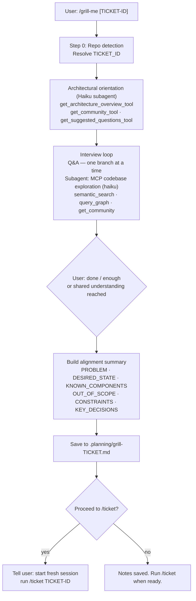
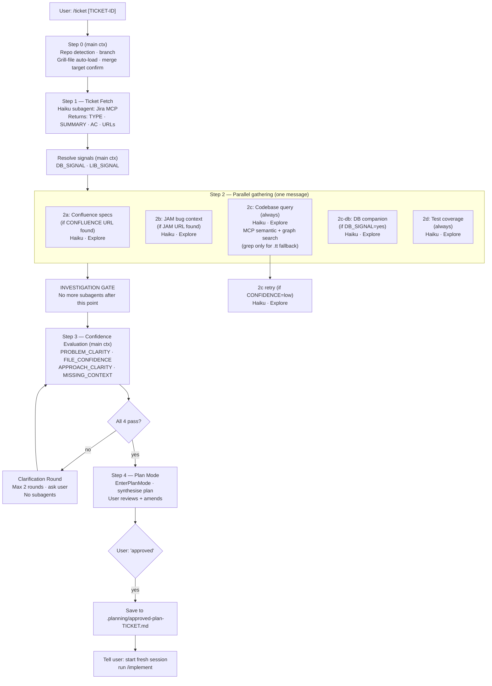
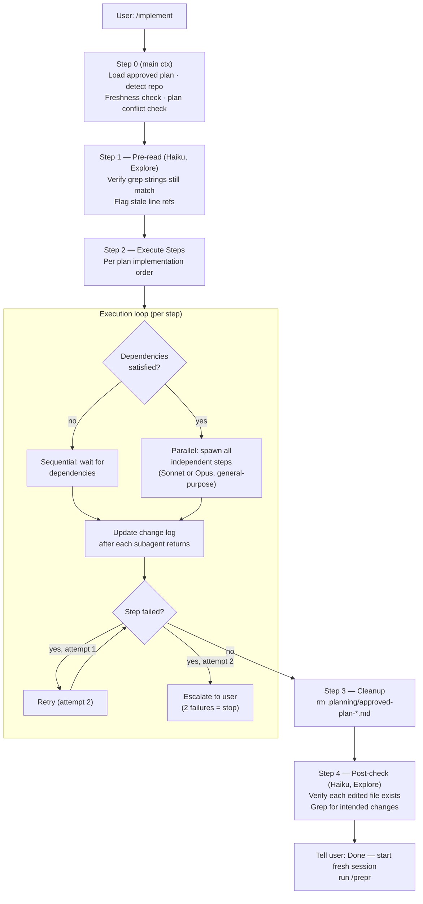
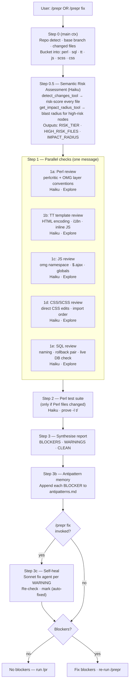
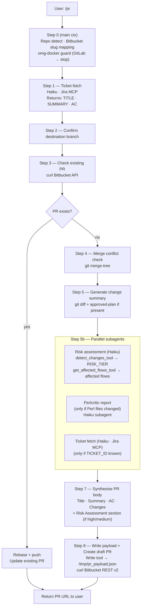
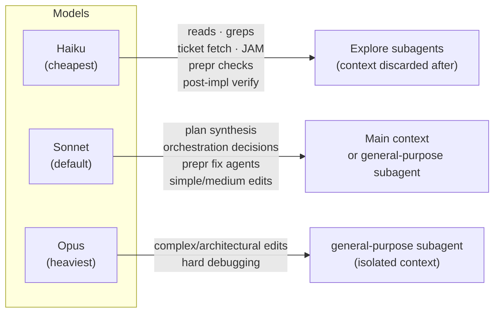
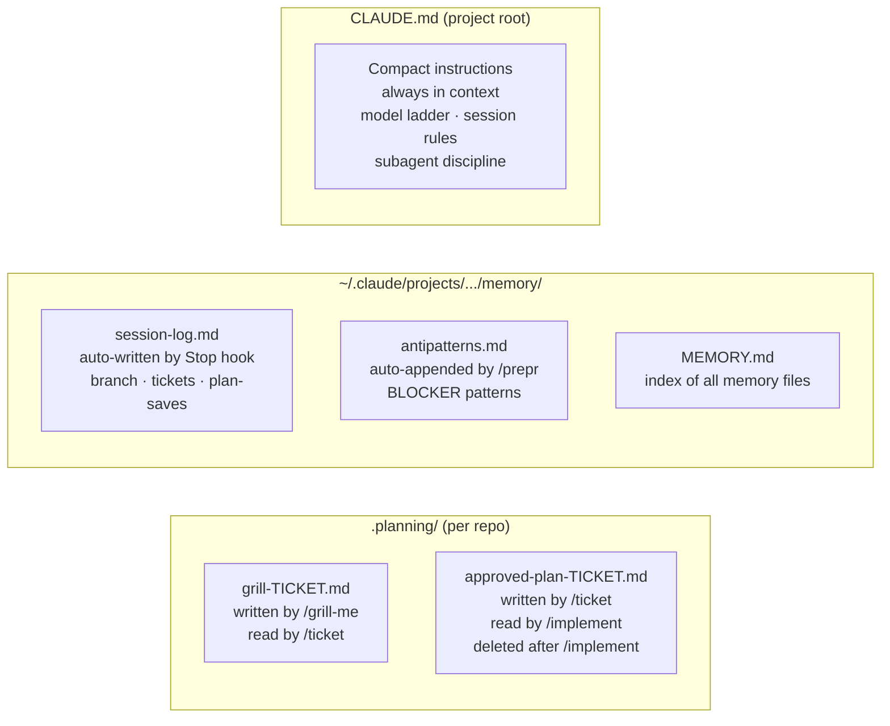

# OMG Pipeline — Workflow & Architecture

## 1. Pipeline Overview

**Session rule:** Each phase = its own fresh session. Exception: `/grill-me` may hand off to `/ticket` in the same session if the user confirms.

---

## 2. Session Boundaries & Artifacts

---

## 3. /grill-me — Internal Architecture

---

## 4. /ticket — Internal Architecture

---

## 5. /implement — Internal Architecture

---

## 6. /prepr — Internal Architecture

---

## 7. /pr — Internal Architecture

---

## 8. Subagent Model Ladder

---

## 9. Persistence Map

